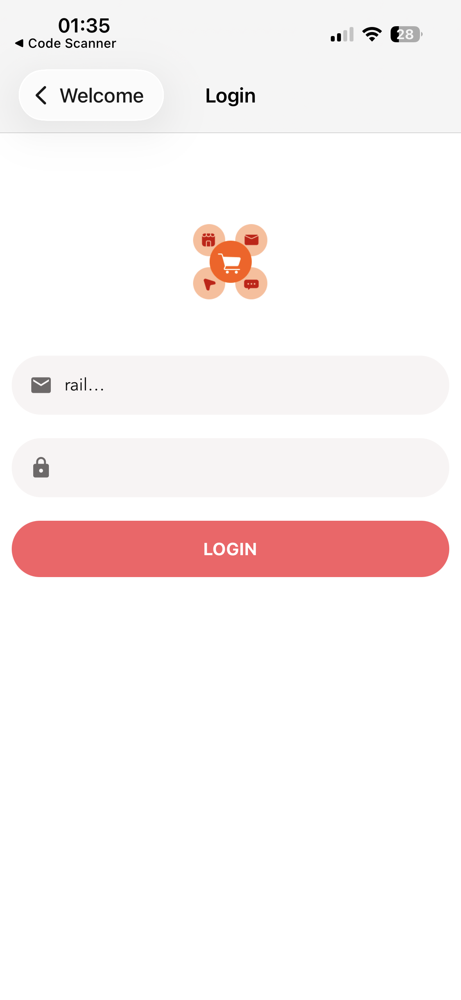
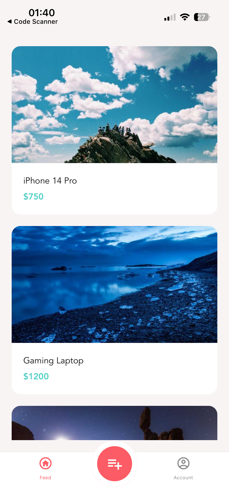
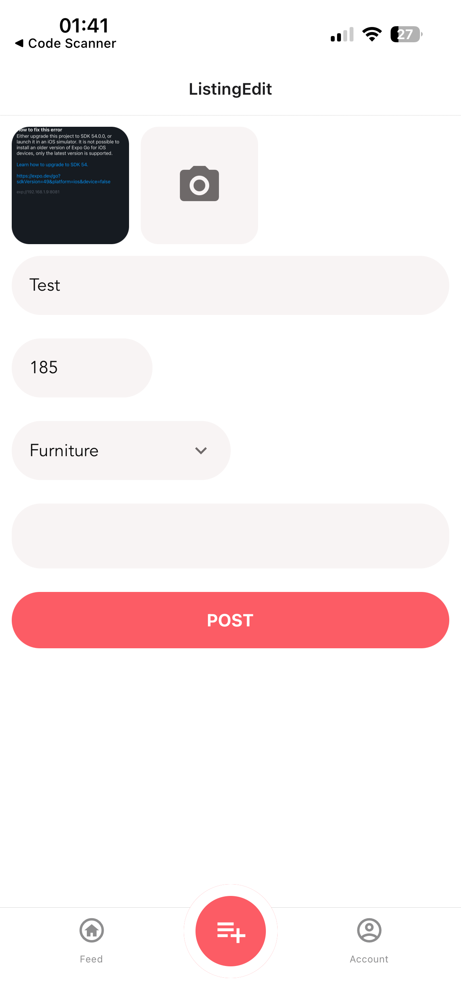

# Reselling App

A mobile marketplace application built with React Native and Expo.

## Features

* User authentication
* JWT-based login system
* Marketplace listings
* Listing creation and editing
* Image uploads
* Account management
* Custom React hooks
* API integration
* Form validation

## Technologies Used

* React Native
* Expo
* JavaScript
* Axios
* React Navigation
* React Context
* Yup
* JWT Authentication

## Screenshots

### Welcome


### Login


### Register


### Listing Details


### Create Listing


## Installation

```bash
npm install
npx expo start
```

## Project Structure

* Authentication system
* Marketplace feed
* Listing management
* User account management
* API communication layer
* Reusable components

## What I Learned

* Mobile application architecture
* Authentication flows
* API integration
* State management
* React Native development
* Form handling and validation
